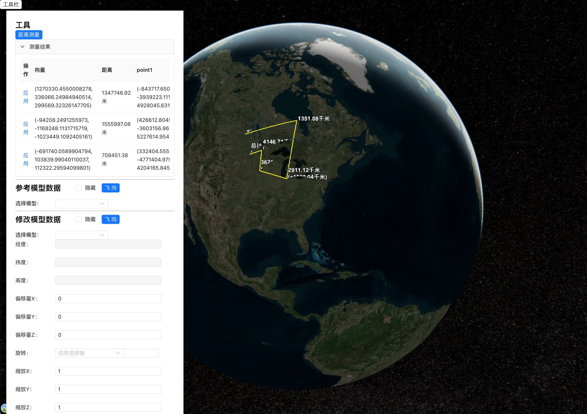
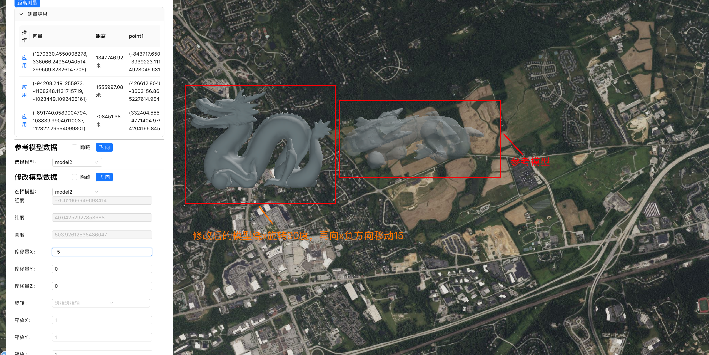

# 介绍

主要应用于`tieset`局部变换（包括平移、旋转、缩放）
`cesium-model-correction-tool` 为 web 端
`server-model-correction` 为服务端

# 使用

1. `server-model-correction` 下载依赖
   `pnpm install`
2. 启动 `server-model-correction` 服务
   `pnpm start`
3. 访问：`localhost:3000`

# 说明

1. 在输入框中输入值，按`Enter`键，即可看到效果
2. 局部转换是叠加操作，即在上一次局部变换的结果再进行一次新的变化
3. 最后保存可修改`tiset.json` 中的`transform`属性
